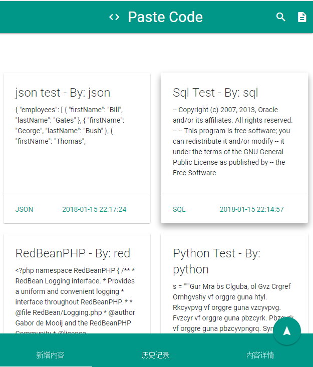

# Paste Code
Make a website with PHP to share codes and store data into sqlite3.

## Notice
* Material Design: [materialize](https://github.com/Dogfalo/materialize)
* Materialize Pagination: [materialize-pagination](https://github.com/mirjamsk/materialize-pagination)
* Code HighLight: [highlight.js](https://github.com/isagalaev/highlight.js)
* RedBeanPHP ORM: [RedBeanPHP](https://github.com/gabordemooij/redbean)

## Todo
- [x] search.
- [x] use vue.

## ScreenShot

