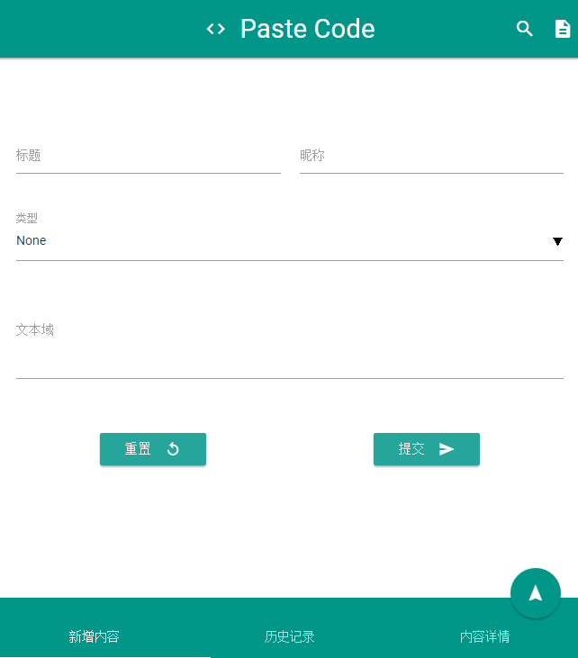
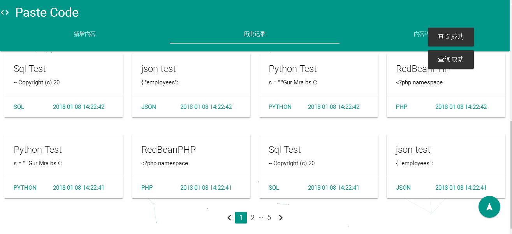

# Paste Code

Make a website with PHP to share codes and store data into sqlite3.
Try to use VueJs, But It's to hard for me.

## Notice
* Material Design: [materialize](https://github.com/Dogfalo/materialize)
* Vue: [Vue](https://cn.vuejs.org/v2/guide/)
* RedBeanPHP ORM: [RedBeanPHP](https://github.com/gabordemooij/redbean)

## ScreenShot

